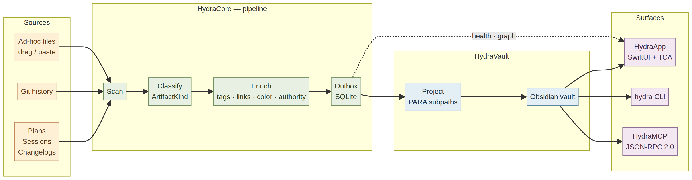
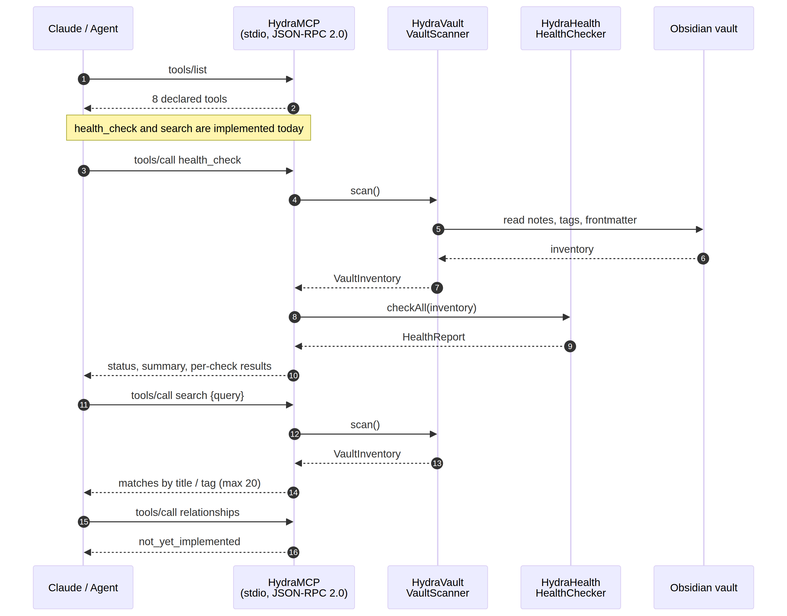
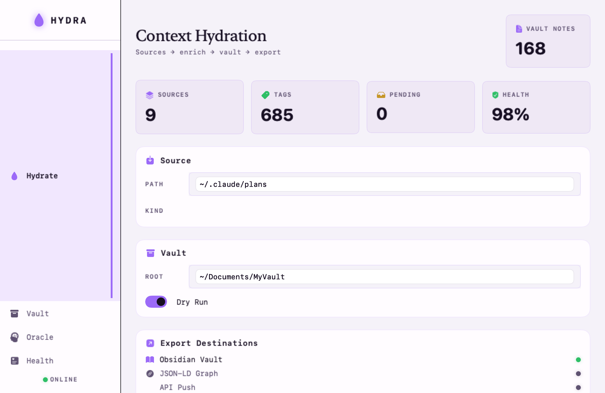
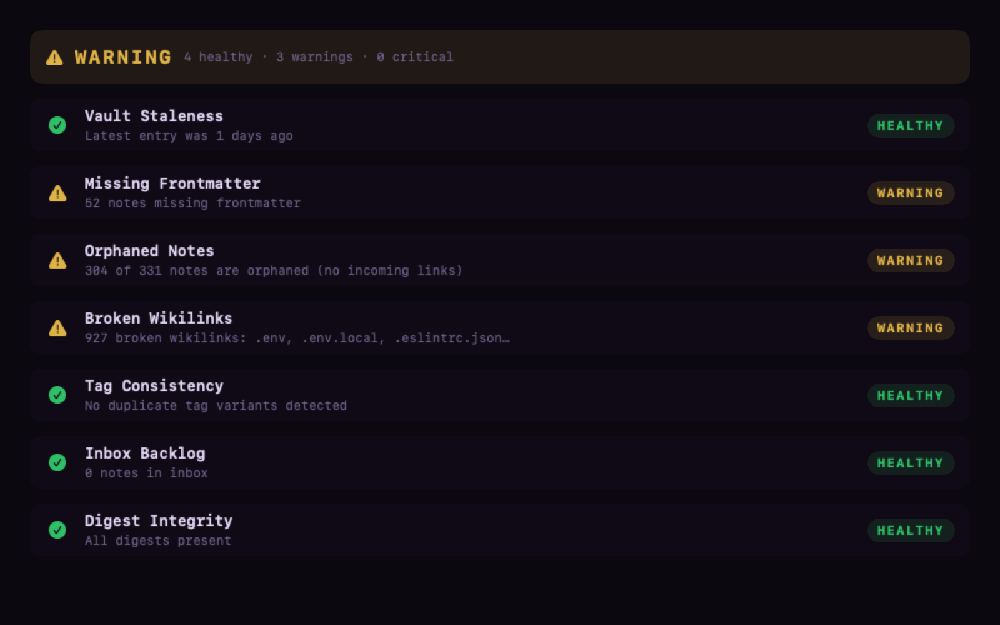

<div align="center">


# Hydra

**Context hydration engine for second brains.** Turns scattered agent work — plans, sessions, changelogs, git history, loose files — into a connected Obsidian vault that humans *and* agents can query.

100% Swift. SwiftUI app for people, CLI and MCP server for agents.

[](https://swift.org)
[](https://developer.apple.com)
[](https://github.com/pointfreeco/swift-composable-architecture)
[](https://modelcontextprotocol.io)
[](https://github.com/Ripnrip/Hydra/releases)
[](LICENSE)
[](https://guriboycodes.com)

</div>

---

## The problem

Agent-assisted work generates a constant stream of artifacts: session transcripts, plan files, decision records, changelogs, incident notes. They pile up in `~/.claude/`, scratch directories, and git history — write-once, read-never. The knowledge exists but has no shape, so neither you nor your agents can navigate it.

Hydra is the pipeline that gives it shape. It scans those sources, classifies each artifact, enriches it with tags, links, provenance and an authority level, stages it in a durable outbox, then projects it into an Obsidian vault along PARA-style paths. From there the same graph is readable through a native app, a CLI, and an MCP server.

## How it works

<div align="center">

</div>

Four hydration modes cover the ways context actually arrives:

| Mode | Behavior |
|---|---|
| **Backfill** | Historical batch scan over existing sources |
| **Watch** | Real-time filesystem events |
| **Ad-hoc** | Interactive drag and paste for one-off artifacts |
| **Query** | Oracle mode — traverse the hydrated graph |

Classification is driven by `ArtifactKind`, and each kind owns its destination in the vault. A plan lands in `wiki/plans`, a session recap in `wiki/recaps/sessions`, a decision record in `wiki/decisions`, and so on, so projection is deterministic rather than ad-hoc.

## Agent interface

Hydra speaks MCP over Claude's stdio transport, so an agent can inspect and search the same vault a human browses in the app.

<div align="center">

</div>

Eight tools are declared. **Two are implemented today**, and the rest return `not_yet_implemented` rather than pretending to work:

| Tool | Status |
|---|---|
| `health_check` | Implemented — full vault scan plus health report |
| `search` | Implemented — title and tag matching, capped at 20 results |
| `hydrate`, `relationships`, `gaps`, `timeline`, `tag_report`, `projectNote` | Declared, not yet implemented |

## The app

The SwiftUI surface is built with The Composable Architecture and covers hydration config, a dry-run preview before anything touches the vault, a relationship graph, and health. Every view ships with an Xcode `#Preview`.

<div align="center">


<br>
<sub>Committed snapshot-test output — light and dark are both covered by <code>SnapshotTests</code>.</sub>
</div>

## Modules

| Module | Purpose |
|---|---|
| `HydraCore` | Domain models, pipeline contracts, authority hierarchy, lifecycle and delivery states |
| `HydraVault` | Obsidian vault scanner, writer, inventory, PARA categories |
| `HydraHealth` | Health checks, filesystem watcher, maintenance scheduler — all Swift, no shell scripts |
| `HydraGraph` | Relationship graph model behind the oracle and graph views |
| `HydraMCP` | JSON-RPC 2.0 MCP server on Hummingbird, Claude stdio transport |
| `HydraCLI` | The `hydra` executable |
| `HydraApp` | SwiftUI + TCA app |

## Quick start

Requires macOS 15+ and a Swift 6.2 toolchain.

```bash
git clone https://github.com/Ripnrip/Hydra.git
cd Hydra
swift build
swift test
```

Then drive it from the CLI:

```bash
# inspect a vault without writing anything
hydra scan   --vault ~/Documents/MyVault
hydra health --vault ~/Documents/MyVault

# hydrate from a source (use --dry-run first)
hydra hydrate --source ~/.claude/plans --vault ~/Documents/MyVault --dry-run

# search the hydrated graph
hydra search --vault ~/Documents/MyVault --query "authority"

# serve the MCP endpoint for an agent
hydra serve --vault ~/Documents/MyVault
```

Run the app target with `swift run HydraApp`.

> Start with `--dry-run`. The dry-run preview exists specifically so you can see the projected notes before Hydra writes into a vault you care about.

## State model

`HydraCore` encodes two orthogonal lifecycles. `LifecycleState` tracks editorial progress — `draft`, `accepted`, `active`, `completed`, `superseded`, `abandoned`, `archived`. `DeliveryState` describes an eight-stage delivery pipeline from `submitted` through `certified`.

Only `submitted` and `blocked` are mechanically enforced today; the remaining six delivery states are policy-defined and exposed via `isMechanicallyTracked` so callers can tell the difference. That distinction is deliberate — the model is designed ahead of the enforcement, and the code says so.

## Testing

Forty test functions span `HydraCoreTests`, `HydraVaultTests`, `HydraHealthTests` and `SnapshotTests`. The snapshot suite covers the app in light and dark for every delivery state, confidence level, and end-to-end hydration stage, with reference images committed to the repo.

## Dogfooding

Developed against a live SecondBrain vault: 331 notes, 685 tags, PARA structure, 16 Obsidian plugins.

## Status

Early and honest. The pipeline, vault projection, health checks, CLI, app and MCP transport work. Six of eight MCP tools and six of eight delivery states are declared but not yet enforced. Treat `v0.1.0` as a working foundation rather than a finished product, and use `--dry-run` before pointing it at a vault you cannot afford to lose.

## License

MIT — see [LICENSE](LICENSE).

---

<div align="center">
<sub>Built by <a href="https://guriboycodes.com">Gurinder Singh</a> · <a href="https://github.com/Ripnrip">@Ripnrip</a></sub>
</div>
